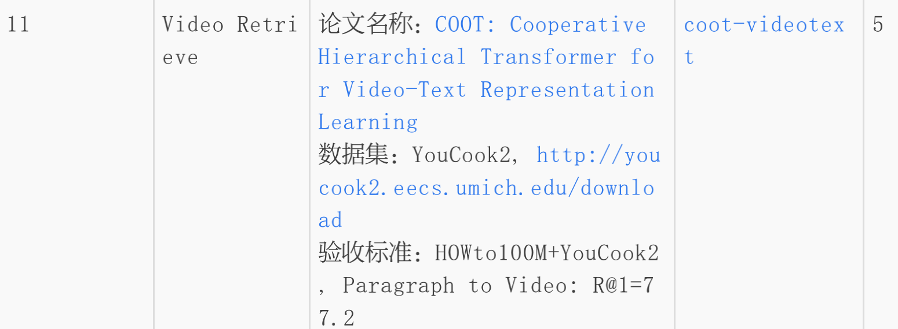
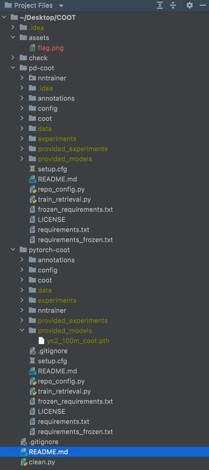

# coot-vieotext-paddle


# 1.安装环境
Python 3.8
# 2.下载大文件(无法上传GitHub)
[数据集百度网盘下载链接](https://pan.baidu.com/s/1raSjxWL3lyKzk5th0jfpyw)

提取码: *ubup*
解压data,将data,provided_models,provided_experiments在pytorch-coot目录和pd-coot各放一份,目录结构如下

```shell
cd pytorch-coot

pip install -r requirements.txt
```
# 3.运行pytorch版本代码

```shell
python train_retrieval.py -c config/retrieval/paper2020/yc2_100m_coot.yaml
python train_retrieval.py -c config/retrieval/paper2020/yc2_100m_coot.yaml --load_model provided_models/yc2_100m_coot.pth --validate
python test_embeddings_retrieval.py provided_embeddings/yc2_100m_coot_val.h5
```

**有early stop,想重新训练,删除experiments文件夹即可**
# 4.最爱的paddle复现ing
进度:正在修改API


